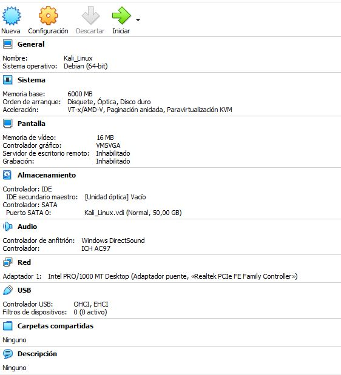
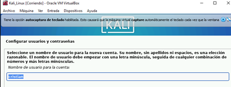
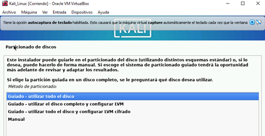
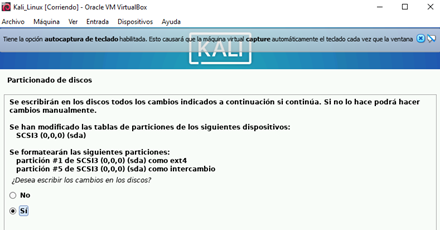
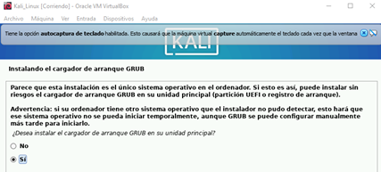
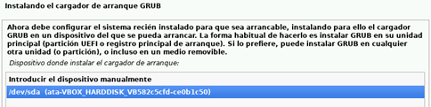

# Instalación y configuración de entorno de pruebas con Kali Linux

Este proyecto documenta el proceso de instalación de Kali Linux en VirtualBox, actualización de paquetes y creación de un entorno de pruebas con Docker y Metasploitable2.

---

## 🧰 Requisitos previos

- VirtualBox y extensión instalada.
- ISO de Kali Linux.
- Conexión a internet para actualizar paquetes y descargar contenedores.

---

## 🖥️ Instalación de Kali Linux

1. Crear la nueva máquina virtual.
2. Asignar memoria RAM y espacio en disco.
3. Cargar la ISO en la sección de almacenamiento.
 
<p align="center">
  
</p>

4. Iniciar la instalación desde el menú de arranque.

<p align="center">
  
</p>


5. Seleccionar idioma: **Español (Colombia)**.
6. Teclado: **Español**.

<p align="center">
  
</p>

7. Configurar red: nombre de la máquina `kali`, sin dominio.
8. Crear usuario: `tu-nombre`. Contraseña: `*****`.

<p align="center">
  
</p>

9. Seleccionar disco virtual, particionar e instalar el sistema.

<p align="center">
  
</p>

<p align="center">
  
</p>

10. Instalar cargador de arranque y reiniciar.

<p align="center">
  
</p>

<p align="center">
  
</p>

11. Instalación Completa

<p align="center">
  
</p>
   
12. Iniciar sesión con las credenciales configuradas.

---

## 🔄 Actualización del sistema

```bash
sudo apt update
sudo apt upgrade -y
```

> Puede requerir confirmaciones manuales en algunos paquetes.

---

## 🐳 Instalación de Docker y red virtual

```bash
sudo apt install docker.io
```

### Crear red virtual

```bash
sudo docker network create redkali --attachable --subnet 10.255.255.0/24
```

---

## 📦 Descargar e iniciar contenedor Metasploitable2

```bash
sudo docker pull tleemcjr/metasploitable2
```

### Crear contenedor

```bash
sudo docker run -it \
  --network redkali \
  --ip="10.255.255.2" \
  --name matasploitable \
  --hostname metasploitable2 \
  tleemcjr/metasploitable2 bash
```

### Iniciar servicios vulnerables

```bash
/bin/services.sh
```

---

## ✅ Comprobación final

Abrir en navegador:

```
http://10.255.255.2
```

---

## 📸 Capturas

Las imágenes del proceso se encuentran en la carpeta `screenshots/`.

---

## ✍️ Autor

[**Yuber Cristian Sánchez Ospina**](https://github.com/Cris-San)
